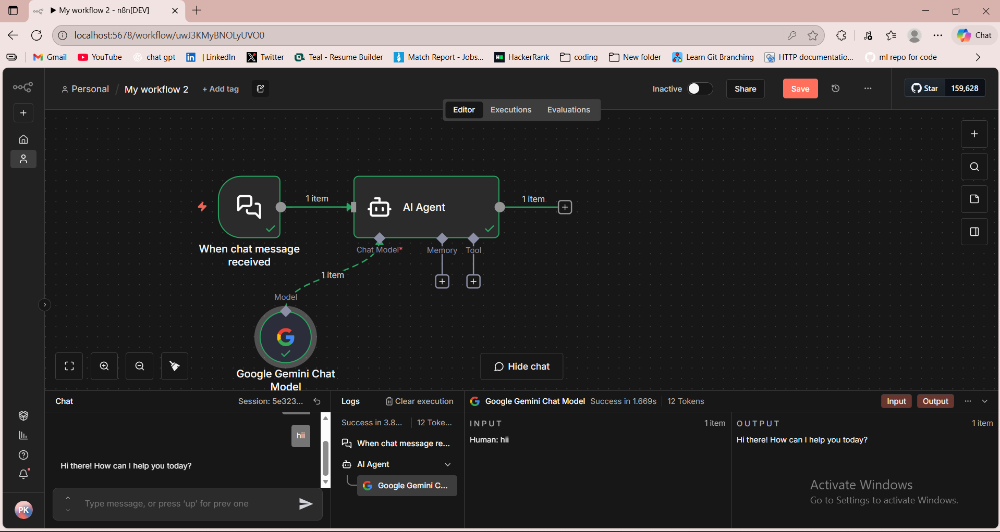
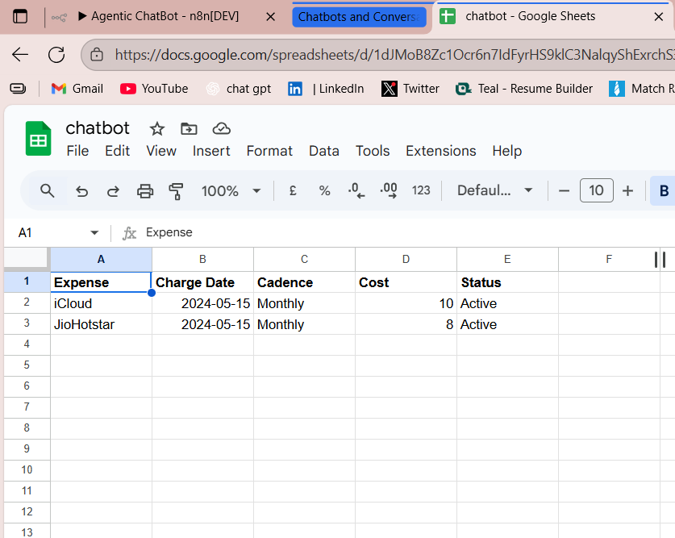

# **Agentic Subscription Tracker Chatbot (n8n + Gemini + Tool-Calling)**

An intelligent **agentic chatbot** built using **n8n**, **Google Gemini**, and **Google Sheets**, designed to automatically track and update user subscriptions.
The bot understands free-form natural language, extracts structured fields, and autonomously writes entries into a live Google Sheet.

---

## 🌟 **Overview**

This project demonstrates a real-world **LLM agent**, combining:

* Natural language understanding
* Intent detection
* Structured JSON field extraction
* Short-term memory
* Function/tool calling
* Automated data logging

Send a message like:
*“I subscribed to Canva Pro for 12.99 monthly.”*
and the agent will process it, extract structured fields, and store it in Google Sheets—without any manual effort.

---

## ⚙️ **Architecture**

The workflow is composed entirely inside **n8n**, orchestrating LLM reasoning with automation tools.

### **🔧 Workflow Structure**

```text
Chat Trigger → LLM Agent (Gemini) → Memory Buffer → Tool (Google Sheets) → Spreadsheet Entry
```

### **🖼️ Workflow Screenshot**



---

## 🤖 **How the Agent Works**

### **1. Chat Trigger**

Activates whenever the user sends a message.

### **2. AI Agent (Gemini)**

Understands intent and extracts:

* Expense
* Charge Date
* Cadence
* Cost
* Status

Applies reasoning rules for:

* New subscriptions
* Price/cadence updates
* Cancellations

### **3. Memory Buffer**

Keeps short-term conversation context, enabling multi-turn interactions.

### **4. Tool-Calling (Google Sheets Append)**

The agent outputs structured data → the tool writes it directly into Google Sheets.

---

## 📊 **Google Sheets Output Example**



This shows how the agent logs clean, structured entries into the Expense Tracker sheet.

---

## 🛠️ **Tech Stack**

* **n8n Agent Framework**
* **Google Gemini**
* **Function / Tool Calling**
* **Memory Buffer Window**
* **Google Sheets API**
* **JSON extraction logic**

---

## 🚀 **Key Features**

* Understands natural language
* Extracts structured subscription details
* Handles updates and cancellations
* Autonomous spreadsheet updates
* Zero manual intervention
* Real-world agentic workflow demonstrating LLM + automation integration

---

## 📁 **Included Files**

| File                   | Description                      |
| ---------------------- | -------------------------------- |
| `Agentic ChatBot.json` | Full n8n workflow export         |
| `2ss.png`              | Workflow architecture screenshot |
| `4ss.png`              | Google Sheets output screenshot  |

---

## ✨ **Why This Project Stands Out**

This isn’t a simple chatbot — it is a **fully agentic automation system**, capable of reasoning, extracting data, and performing actions through tools.
It demonstrates practical skills in:

* GenAI engineering
* Workflow automation
* Prompt engineering
* LLM tool-calling
* Real, production-style integrations


Just tell me!
